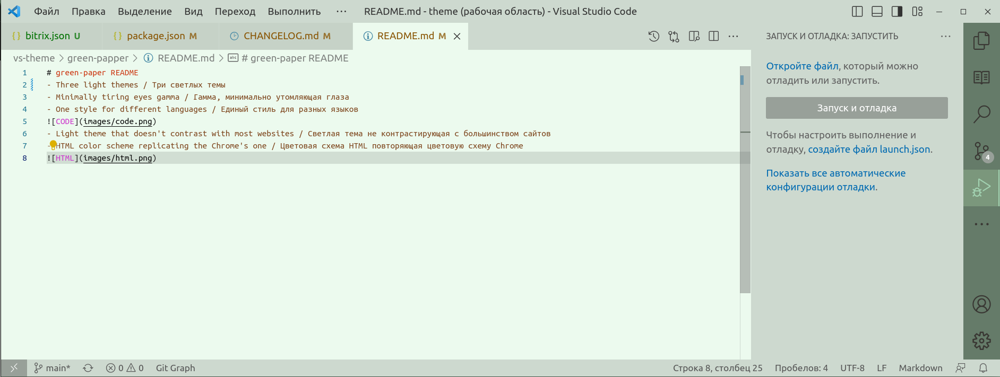
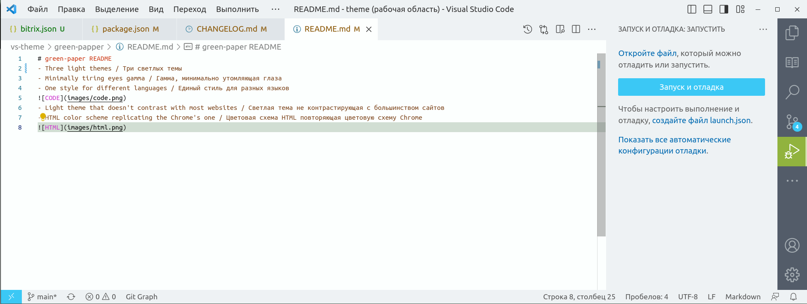
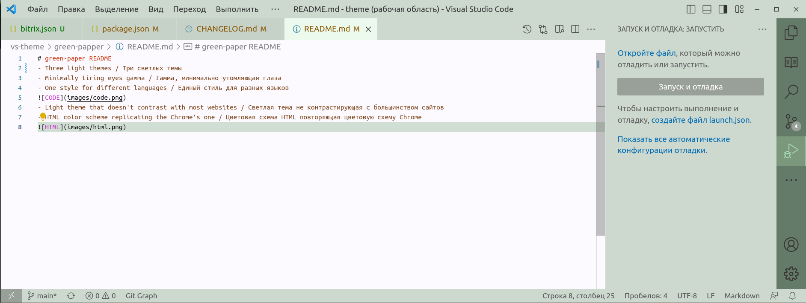
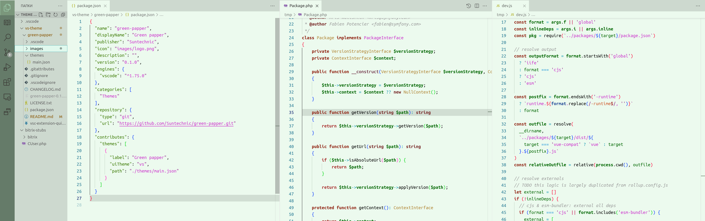
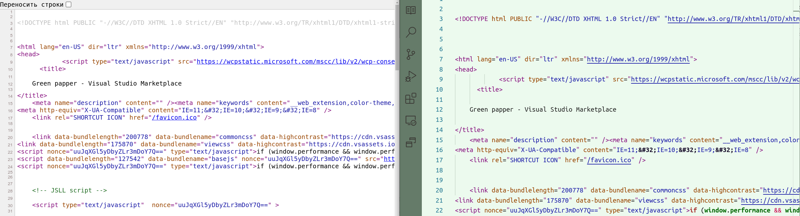

# Green Papper

Набор цветовых тем для Visual Studio Code с мягкой зелёной гаммой и единым стилем подсветки кода.

A collection of Visual Studio Code themes with a soft green palette and a consistent code-highlighting style.

## Темы / Themes

В расширение входят семь вариантов:

The extension includes seven variants:

- **Green paper** — основная зелёная тема / the main green theme
- **Green Chrome** — зелёная тема в стиле Chrome / a Chrome-inspired green theme
- **Green Chrome: base** — базовый вариант Green Chrome / the base Green Chrome variant
- **Green Chrome Dark: base** — тёмный базовый вариант Green Chrome / the dark base Green Chrome variant
- **Vert Guignet Chrome** — тёплая Chrome-палитра / a warm Chrome-inspired palette
- **Green paper white** — светлый нейтральный вариант / a light neutral variant
- **Green paper bitrix** — вариант для работы с Bitrix / a Bitrix-oriented variant

Большинство вариантов рассчитано на светлый интерфейс VS Code; **Green Chrome Dark: base** предназначена для тёмного интерфейса.

Most variants are designed for the light VS Code interface; **Green Chrome Dark: base** is designed for the dark interface.

## Особенности / Features

- Мягкая цветовая гамма, рассчитанная на длительную работу / a soft palette for extended work sessions
- Единый стиль подсветки для разных языков / consistent highlighting across languages
- Поддержка современных областей интерфейса VS Code: sticky scroll, inlay hints, minimap, peek view, Git, notebooks и Chat / support for modern VS Code UI areas including sticky scroll, inlay hints, minimap, peek view, Git, notebooks and Chat
- Отдельная терминальная палитра с различимыми ANSI-цветами / a dedicated terminal palette with distinguishable ANSI colors
- HTML-подсветка в стиле Chrome / Chrome-inspired HTML highlighting

Светлые темы не создают резкого контраста с большинством веб-сайтов, а тёмный вариант снижает нагрузку на глаза при работе в тёмном интерфейсе.

The light themes avoid harsh contrast with most websites, while the dark variant reduces eye strain when working with a dark interface.

## Установка / Installation

Установите расширение Green Papper в VS Code, затем откройте палитру команд (`Ctrl+Shift+P`) и выберите `Preferences: Color Theme`.

Install the Green Papper extension in VS Code, then open the Command Palette (`Ctrl+Shift+P`) and choose `Preferences: Color Theme`.
