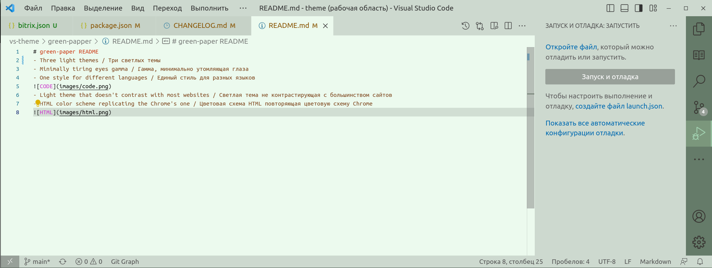
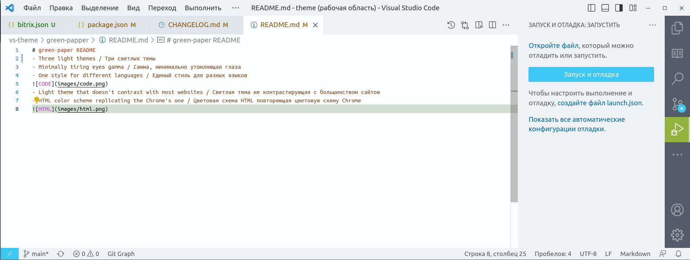
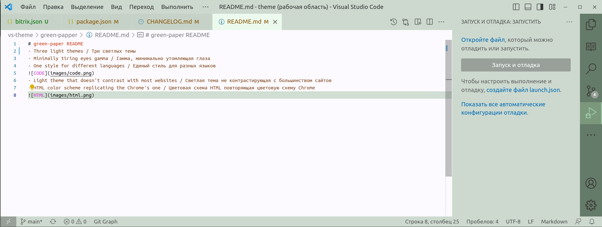
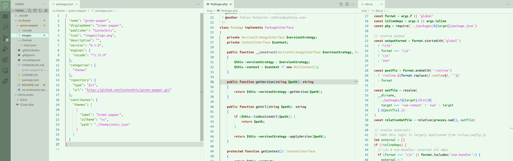

# green-paper README
- Three light themes / Три светлых темы

- Minimally tiring eyes gamma / Гамма, минимально утомляющая глаза
- One style for different languages / Единый стиль для разных языков

- Light theme that doesn't contrast with most websites / Светлая тема не контрастирующая с большинством сайтов
- HTML color scheme replicating the Chrome's one / Цветовая схема HTML повторяющая цветовую схему Chrome
